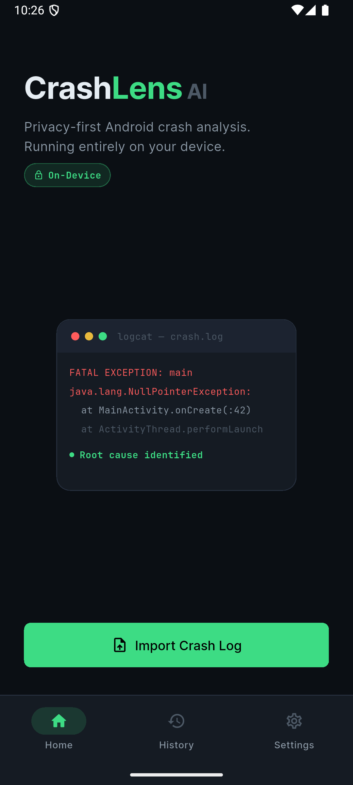
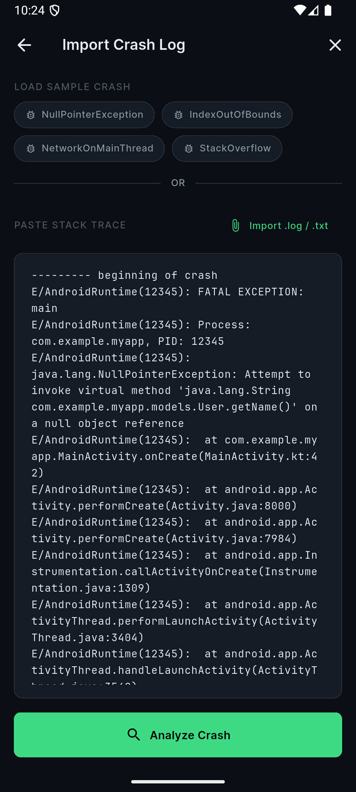
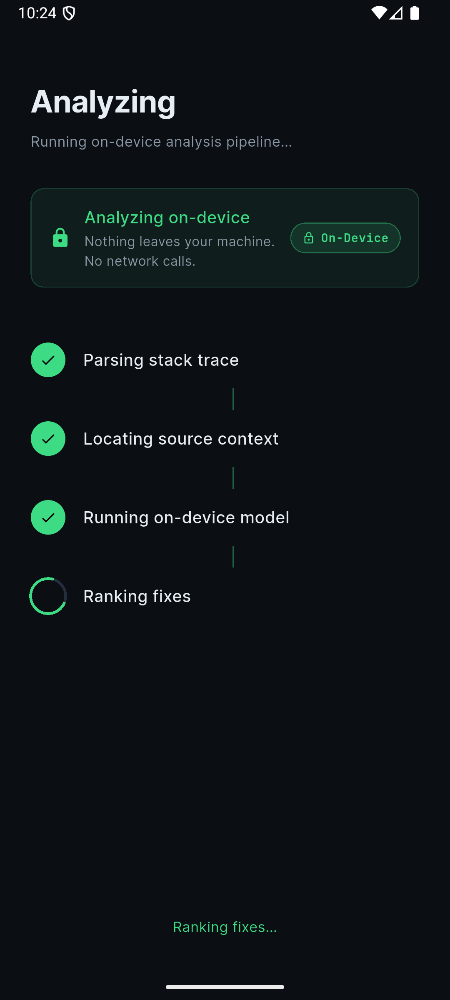
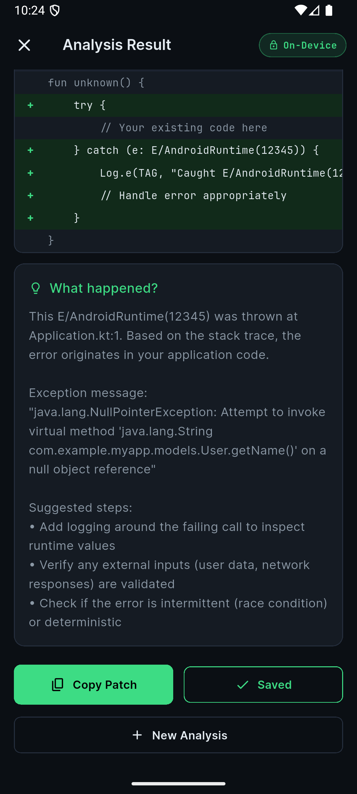
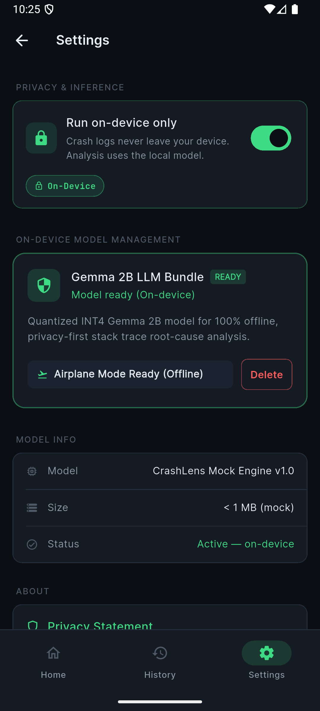
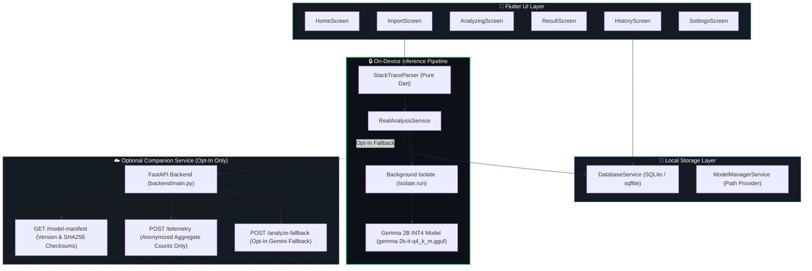

# CrashLens AI

> **CrashLens AI — go from Android crash to validated fix in seconds, entirely on-device.**

[](https://flutter.dev)
[](LICENSE)
[](https://iqoo.com)
[](README.md#6-why-on-device-matters)

---

## 1. The Problem

Debugging Android crashes in production or local builds is slow, tedious, and error-prone. Developers spend hours parsing multi-hundred-line logcat stack traces to isolate the implicated file and line. Furthermore, uploading proprietary source code or confidential crash dumps to cloud AI APIs poses severe privacy, security, and compliance risks for enterprise teams and developers alike.

---

## 2. The Solution

**CrashLens AI** solves this with an instant, privacy-first, on-device Android debugging assistant. It ingests logcat stack traces, parses the failure context, matches the implicated source lines, and generates a confidence-ranked code patch with plain-English explanation — running 100% locally on the device with **zero data leaving the phone**.

### Core Workflow

1. **Capture**: Paste logcat dumps, load `.log`/`.txt` files, or pick from pre-loaded sample crash fixtures.
2. **Parse**: Extract exception type, message, and isolate first-party app stack frames from framework noise.
3. **Analyze**: Run local LLM inference via an on-device Gemma 2B model bundle on a background isolate.
4. **Patch**: Render a color-coded unified code diff (`+`/`-`), root cause breakdown, and confidence score.

---

## 3. Screenshots

<p align="center">
  
    
  
    
  
    
  
    
  
</p>

| Home                     | Import                           | Analyzing                             | Result                               | Settings                                  |
| ------------------------ | -------------------------------- | ------------------------------------- | ------------------------------------ | ----------------------------------------- |
| Dashboard & quick import | Stack trace paste & sample chips | Step-by-step progress & privacy badge | Root cause, patch diff & explanation | On-device model toggle & download manager |

---

## 4. Architecture Diagram



---

## 5. Tech Stack

- **Mobile Framework**: Flutter 3.6+ (Dart)
- **On-Device Inference**: Gemma 2B-it (INT4 / Q4_K_M quantized GGUF bundle via background `Isolate`)
- **Stack Trace Parser**: Custom pure-Dart regex & grammar filter (`StackTraceParser`)
- **Local Storage**: SQLite via `sqflite` (`crashlens.db`)
- **Design System**: Dark Mode palette (`#0B0F14` bg, `#151B23` surface, `#3DDC84` Android green accent, Inter UI font, JetBrains Mono code font)
- **Companion Backend**: Python 3.11 + FastAPI (`backend/main.py`)

---

## 6. Why On-Device Matters

1. **Air-Gapped Privacy**: Proprietary source code and internal stack traces never leave the device.
2. **Zero Cloud Costs**: Eliminates recurring LLM API token costs per crash analysis.
3. **Offline Reliability**: Works in airplane mode or low-connectivity mobile environments.
4. **Latency Independence**: Immune to cloud API rate limits, outages, or network latency spikes.

---

## 7. Setup & Run Instructions

### Mobile Application (`mobile / root`)

```bash
# 1. Clone the repository
git clone https://github.com/chandril-mallick/crashlens_ai.git
cd crashlens_ai

# 2. Install dependencies
flutter pub get

# 3. Analyze code
dart analyze

# 4. Run application
flutter run
```

### Optional Companion Backend (`backend/`)

```bash
cd backend

# 1. Create & activate virtual environment
python -m venv venv
source venv/bin/activate

# 2. Install dependencies
pip install -r requirements.txt

# 3. Run FastAPI server
uvicorn main:app --host 0.0.0.0 --port 8000
```

---


## 8. Build Process

This repository reflects the Phase 1 prototype — built as a proof of concept ahead of the event for idea validation.

The on-ground build (iQOO Battle 04, Hyderabad — 26–27 Sept) will follow iQOO's phone-first hybrid format:

- **Red Light (~55% of build time)**: primary development on the iQOO 15 via iQOO Office Kit — laptop closed as a build machine.
- **Green Light (~45%)**: laptop-assisted work for heavier compute (Gradle builds, model integration debugging).

## 9. Demo Video Link

 **Watch the Walkthrough Video**:(https://youtube.com/shorts/SO9WEFVJhIU?feature=share)

---

## 10. Team & Attribution

- **Team Name**: Deploy or Die (SF1YI2)
- **Members**:
  - Chandril mallick  - Leader
  - Farhan Islam Sekh 
- **Event**: iQOO City Battles — Hackathon 04
- **Platform Target**: Android (Phone-First, Hybrid Build)

---

## 11. Post Roadmap

- [ ] **Live USB ADB Capture**: Automatically pull active crash logs from connected Android devices via ADB WebUSB.
- [ ] **Multi-Language Support**: Expand stack trace parsing & patch generation to iOS (Swift/Obj-C) and Flutter/Dart exceptions.
- [ ] **Team Aggregate Dashboard**: Aggregate anonymized crash categories via `POST /telemetry` to visualize team crash trends.
- [ ] **IDE Extensions**: Android Studio & VS Code plugins for 1-click on-device fix application.

---

## 12. License

This project is licensed under the MIT License — see the [LICENSE](LICENSE) file for details.
