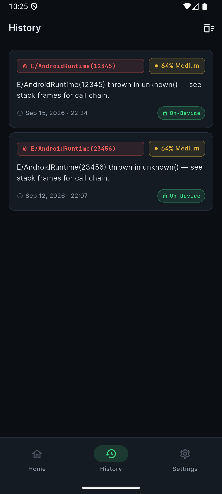

# CrashLens AI 

> **Privacy-first, on-device Android crash debugging assistant.**  
> From "app crashed" to "here's a validated fix" in seconds — no crash log or source code leaves your device.

<p align="center">
  
  &nbsp;&nbsp;
  
  &nbsp;&nbsp;
  
</p>

<p align="center">
  
  &nbsp;&nbsp;
  
  &nbsp;&nbsp;
  
</p>

---

## What it does

CrashLens AI takes an Android Logcat crash / stack trace and:

1. **Parses** the stack trace — identifies the exception type, the first-party frame, and the full call chain.
2. **Runs on-device LLM inference** (Gemma 2B-it via `flutter_gemma` / MediaPipe) to generate a root-cause explanation and a concrete code patch.
3. **Presents a confidence-ranked fix** with a side-by-side diff view and a plain-English walkthrough.
4. **Stores history locally** via SQLite — zero data ever sent to the cloud by default.

All heavy inference is isolated on a background `Isolate` with a 25-second timeout so the UI stays buttery smooth.

---

## Architecture

```
┌──────────────────────────────────────────────┐
│               Flutter UI Layer               │
│  HomeScreen → ImportScreen → AnalyzingScreen │
│        → ResultScreen  HistoryScreen         │
│              SettingsScreen                  │
└──────────────┬───────────────────────────────┘
               │  Provider (state management)
┌──────────────▼───────────────────────────────┐
│           CrashAnalysisProvider              │
│  Orchestrates the full analysis pipeline     │
└──┬──────────────┬───────────────┬────────────┘
   │              │               │
┌──▼──────┐ ┌────▼──────┐ ┌──────▼──────────┐
│ Stack   │ │   LLM     │ │    Database     │
│ Trace   │ │ Inference  │ │    Service      │
│ Parser  │ │ Service   │ │  (SQLite/sqflite)│
└─────────┘ └─────┬─────┘ └─────────────────┘
                  │
       ┌──────────┴──────────┐
       │                     │
┌──────▼──────┐    ┌─────────▼──────────┐
│  Mock LLM   │    │  RealAnalysisService│
│  (Demo mode)│    │  (flutter_gemma /  │
└─────────────┘    │  on-device Gemma)  │
                   └────────┬───────────┘
                            │ (opt-in fallback)
                   ┌────────▼───────────┐
                   │ CloudFallbackService│
                   │  /analyze-fallback  │
                   └────────────────────┘
```

See [`docs/architecture.md`](docs/architecture.md) for a detailed breakdown.

---

##  Tech Stack

| Layer | Technology |
|---|---|
| **Framework** | Flutter 3.x (Dart) |
| **On-device LLM** | Gemma 2B-it INT4 via `flutter_gemma` / MediaPipe |
| **State management** | Provider |
| **Local storage** | SQLite (`sqflite`) |
| **File import** | `file_picker` |
| **Code rendering** | `flutter_highlight` + JetBrains Mono |
| **Fonts** | Google Fonts (Inter/Manrope) + JetBrains Mono |
| **Backend (opt-in)** | FastAPI + Python (cloud fallback only) |

---

## 📂 Repository Structure

```
crash_lens/
├── README.md
├── LICENSE
├── .gitignore
├── docs/
│   ├── architecture.md       # Detailed architecture doc
│   └── screenshots/
│       ├── home.png
│       ├── import.png
│       ├── analyzing.png
│       ├── result.png
│       ├── history.png
│       └── settings.png
├── lib/                      # Flutter app source
│   ├── main.dart
│   ├── models/               # CrashReport, AnalysisResult, ParsedCrashContext
│   ├── providers/            # CrashAnalysisProvider, HistoryProvider, SettingsProvider
│   ├── screens/              # 6 app screens
│   ├── services/             # LLM, parser, DB, model manager, cloud fallback
│   ├── theme/                # AppTheme, colors, text styles
│   └── widgets/              # Shared UI components
├── assets/
│   ├── samples/              # 4 sample crash log files for demo
│   └── fonts/                # JetBrains Mono (Regular + Bold)
├── android/                  # Android-specific config
├── backend/                  # Optional FastAPI cloud fallback
│   ├── main.py
│   ├── requirements.txt
│   └── README.md
└── pubspec.yaml
```

---

## 🚀 Getting Started

### Prerequisites
- Flutter SDK ≥ 3.6.0
- Android SDK (API 24+)
- A physical Android device or emulator (API 24+)

### Run in demo mode (no model download needed)

```bash
git clone https://github.com/<your-username>/crashlens-ai.git
cd crashlens-ai
flutter pub get
flutter run
```

The app launches in **Mock mode** — all 6 screens are navigable and analysis results are simulated instantly. No LLM download required.

### Enable real on-device inference

1. Open the app → **Settings** tab
2. Tap **Download Model** (~1.5 GB, Gemma 2B-it INT4)
3. Once downloaded, toggle **"Use On-Device Model"**
4. Import any crash log — analysis now runs fully on-device 

### Run the optional cloud fallback backend

```bash
cd backend
pip install -r requirements.txt
uvicorn main:app --reload
```

Set `CLOUD_FALLBACK_URL` in Settings to point to your server.

---

## 📱 Screens & User Flow

| Screen | Preview | Description |
|---|---|---|
| **Home** | [`home.png`](docs/screenshots/home.png) | Dashboard with active mode badge, terminal preview, and quick import CTA |
| **Import** | [`import.png`](docs/screenshots/import.png) | Stack trace text area, sample crash chips, and `.log`/`.txt` file picker |
| **Analyzing** | [`analyzing.png`](docs/screenshots/analyzing.png) | Animated 4-step progress (Parse → Source → Infer → Rank) |
| **Result** | [`result.png`](docs/screenshots/result.png) | Confidence score, root cause, code patch diff viewer, and explanation |
| **History** | [`history.png`](docs/screenshots/history.png) | SQLite-backed searchable log archive with on-device badges |
| **Settings** | [`settings.png`](docs/screenshots/settings.png) | On-device model manager, download progress, and cloud fallback toggle |

---

## 🔒 Privacy

- **Zero telemetry.** No crash data, stack traces, or source code is ever sent anywhere by default.
- The on-device model runs in an isolated background `Isolate` — never touches the network.
- Cloud fallback is **opt-in only**, gated by an explicit toggle in Settings.
- All history is stored locally in SQLite — never synced.

---

##  Roadmap

- [ ] ADB live logcat capture integration
- [ ] Source file context attachment (show the actual crashing function)
- [ ] Team shared history (opt-in, encrypted)
- [ ] VS Code / Android Studio extension
- [ ] iOS support (CoreML backend)

---

## 📄 License

MIT — see [`LICENSE`](LICENSE).

---

*Built for the AI Hackathon 2026. Questions? Open an issue.*
