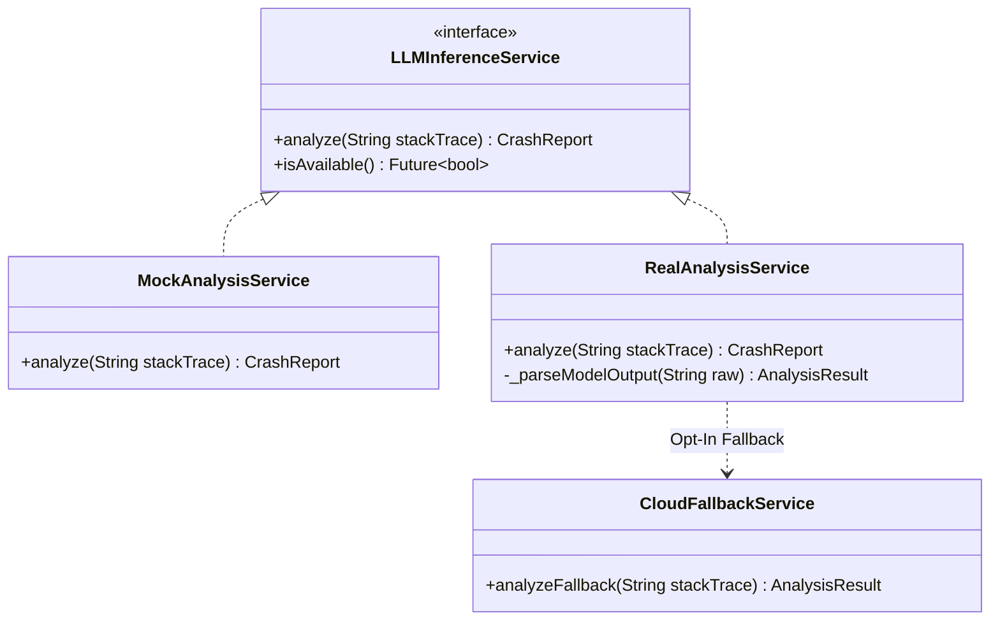
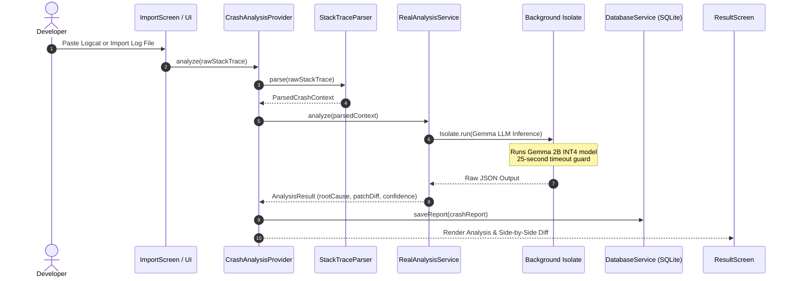
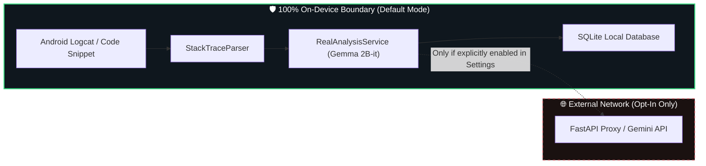

# CrashLens AI — Architecture

## Overview

CrashLens AI is a Flutter application with a layered architecture designed for privacy-first, on-device LLM inference. The key design constraint is that **no user data leaves the device by default**.

---

## 🏗 High-Level Architecture Diagram

```mermaid
flowchart TD
    subgraph UI["📱 Flutter UI Layer (lib/screens & lib/widgets)"]
        HS["HomeScreen"]
        IS["ImportScreen"]
        AS["AnalyzingScreen"]
        RS["ResultScreen"]
        HIST["HistoryScreen"]
        SET["SettingsScreen"]
    end

    subgraph STATE["⚡ State Management (lib/providers)"]
        CAP["CrashAnalysisProvider"]
        HP["HistoryProvider"]
        SP["SettingsProvider"]
    end

    subgraph SERVICES["⚙️ Core Services (lib/services)"]
        STP["StackTraceParser"]
        DBS["DatabaseService (SQLite)"]
        MMS["ModelManagerService"]
    end

    subgraph INFERENCE["🔒 On-Device Inference Engine (Isolated)"]
        direction TB
        LLM_IF["LLMInferenceService Interface"]
        MOCK["MockAnalysisService (Demo Mode)"]
        REAL["RealAnalysisService (Gemma 2B-it)"]
        ISO["Background Isolate.run() (25s Timeout)"]
    end

    subgraph CLOUD["☁️ Cloud Fallback (Opt-In Only)"]
        CFS["CloudFallbackService"]
        API["FastAPI /analyze-fallback Proxy"]
    end

    %% Data Connections
    IS -->|"1. Raw Stack Trace"| CAP
    CAP -->|"2. Parse Frames"| STP
    CAP -->|"3. Execute Inference"| LLM_IF
    
    LLM_IF -->|"Demo Mode"| MOCK
    LLM_IF -->|"On-Device Mode"| REAL
    REAL -->|"Offload Heavy CPU Inference"| ISO
    
    CAP -->|"4. Render Fix & Diff"| RS
    CAP -->|"5. Save Report"| DBS
    HP -->|"Query History"| DBS
    
    LLM_IF -.->"Fallback if Enabled & Local Failed"| CFS
    CFS -.->"POST /analyze-fallback"| API
    SP -->|"Manage Model & Preferences"| MMS

    %% Modern Theme Styling
    style UI fill:#151B23,stroke:#3DDC84,stroke-width:1.5px,color:#FFFFFF
    style STATE fill:#151B23,stroke:#61AFEF,stroke-width:1.5px,color:#FFFFFF
    style SERVICES fill:#151B23,stroke:#E5C07B,stroke-width:1.5px,color:#FFFFFF
    style INFERENCE fill:#0D1117,stroke:#3DDC84,stroke-width:2px,color:#FFFFFF
    style CLOUD fill:#151B23,stroke:#E06C75,stroke-dasharray: 5 5,color:#FFFFFF
```

---

## Layer Breakdown

### 1. UI Layer (`lib/screens/`, `lib/widgets/`)

Six screens connected via a bottom navigation shell (`AppShell`):

- **`HomeScreen`**: Dashboard, recent crashes, terminal log preview, quick-import FAB.
- **`ImportScreen`**: Text paste area, sample crash log chips, `.log`/`.txt` file picker.
- **`AnalyzingScreen`**: Animated 4-step progress indicator (Parse → Source → Infer → Rank).
- **`ResultScreen`**: Root cause, confidence score, code patch diff viewer, explanation.
- **`HistoryScreen`**: Searchable SQLite crash archive with filtering.
- **`SettingsScreen`**: Model download manager, privacy toggle, cloud fallback config.

All screens consume state via `Provider` — zero business logic in UI widgets.

---

### 2. State Layer (`lib/providers/`)

| Provider | Responsibility |
|---|---|
| `CrashAnalysisProvider` | Pipeline orchestrator: input → parse → infer → result |
| `HistoryProvider` | SQLite CRUD operations for past crash analyses |
| `SettingsProvider` | Persists user preferences via `shared_preferences` |

`CrashAnalysisProvider` accepts an injected `LLMInferenceService`, allowing seamless switching between Mock ↔ Real On-Device ↔ Cloud Fallback.

---

### 3. Service Layer (`lib/services/`)



- **`StackTraceParser`**: Regex engine extracting exception types, messages, and first-party frames.
- **`DatabaseService`**: SQLite database wrapper for crash history.
- **`ModelManagerService`**: Manages INT4 Gemma 2B model downloads, verification, and local deletion.

---

### 4. Data Layer (`lib/models/`)

| Model | Key Fields |
|---|---|
| `ParsedCrashContext` | `exceptionType`, `message`, `frames`, `firstPartyFrame` |
| `CrashReport` | `id`, `rawTrace`, `parsedContext`, `timestamp` |
| `AnalysisResult` | `rootCause`, `explanation`, `suggestedFix`, `confidence`, `patchDiff` |

---

## 🔄 End-to-End Analysis Data Flow



---

## 🔒 Privacy Architecture & Boundary



The `CloudFallbackService` is only invoked when:
1. User has explicitly toggled **"Enable Cloud Fallback"** in Settings, AND
2. The on-device model is unavailable (not downloaded or local inference timed out).

---

## Backend (Optional)

`backend/main.py` is a lightweight FastAPI server that proxies requests to Gemini API when cloud fallback is enabled. It is **100% optional** — the app operates entirely offline by default.
